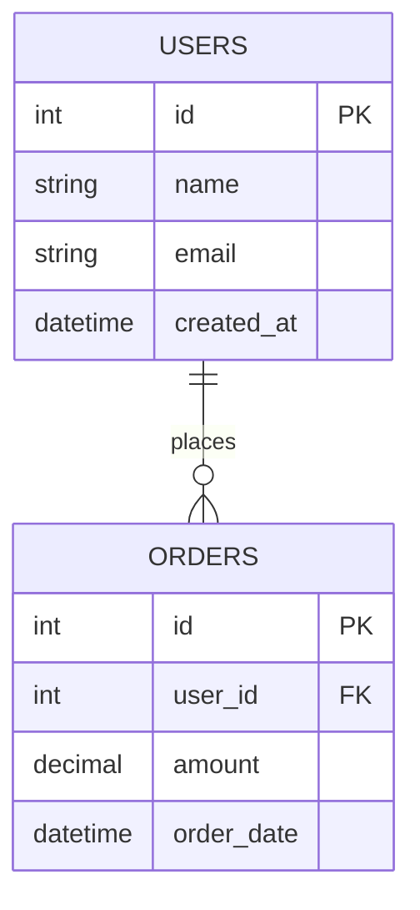

# BigQuery to ERD Tool

## Overview
A Python tool that connects to Google BigQuery, extracts schema information from a specified dataset, and generates an Entity Relationship Diagram (ERD) in Draw.io format.

## Features
- Connect to BigQuery using service account authentication
- Extract table schemas, column information, and data types
- Analyze table relationships based on naming conventions and foreign key patterns
- Generate Draw.io XML format for ERD visualization
- Support for custom relationship mapping rules
- Export to multiple formats (Draw.io XML, Mermaid, PlantUML)

## Requirements
- Python 3.8+
- Google Cloud service account with BigQuery access
- Required Python packages (see requirements.txt)

## Environment Configuration (.env)
```env
# Google Cloud Configuration
GOOGLE_APPLICATION_CREDENTIALS=/path/to/service-account-key.json
PROJECT_ID=your-gcp-project-id
DATASET_ID=your-dataset-name

# BigQuery Configuration
LOCATION=US  # or your preferred location
MAX_RESULTS=1000  # max tables to process

# ERD Generation Settings
OUTPUT_FORMAT=drawio  # drawio, mermaid, plantuml
OUTPUT_FILE=erd_output.drawio
INCLUDE_VIEWS=false
INCLUDE_EXTERNAL_TABLES=false

# Relationship Detection
ENABLE_FK_DETECTION=true
ENABLE_NAMING_CONVENTION_DETECTION=true
CUSTOM_RELATIONSHIP_RULES_FILE=relationship_rules.json

# Draw.io Specific Settings
DRAWIO_THEME=default  # default, dark, minimal
TABLE_LAYOUT=auto  # auto, horizontal, vertical
SHOW_COLUMN_TYPES=true
SHOW_COLUMN_NULLABLE=true
SHOW_INDEXES=false
```

## Usage

### Basic Usage
```bash
python bigquery_to_erd.py
```

### Advanced Usage
```bash
python bigquery_to_erd.py \
  --dataset-id my_dataset \
  --project-id my_project \
  --output-file custom_erd.drawio \
  --format drawio \
  --include-views \
  --custom-rules custom_rules.json
```

### Command Line Arguments
- `--dataset-id`: BigQuery dataset ID (overrides .env)
- `--project-id`: GCP project ID (overrides .env)
- `--output-file`: Output file path
- `--format`: Output format (drawio, mermaid, plantuml)
- `--include-views`: Include views in ERD
- `--include-external-tables`: Include external tables
- `--custom-rules`: Path to custom relationship rules JSON file
- `--verbose`: Enable verbose logging

## Implementation Details

### Core Components

#### 1. BigQuery Connector (`bigquery_connector.py`)
- Authenticate using service account
- List tables in dataset
- Extract table schemas and metadata
- Handle pagination for large datasets

#### 2. Schema Analyzer (`schema_analyzer.py`)
- Parse table schemas and column information
- Detect data types and constraints
- Identify primary keys and indexes
- Extract table relationships

#### 3. Relationship Detector (`relationship_detector.py`)
- **Foreign Key Detection**: Analyze column names and types for FK patterns
- **Naming Convention Detection**: Match tables by naming patterns (e.g., user_id → users.id)
- **Custom Rules Engine**: Apply user-defined relationship rules
- **Data Type Matching**: Match compatible column types across tables

#### 4. ERD Generator (`erd_generator.py`)
- Generate Draw.io XML format
- Create table representations with columns
- Draw relationship lines with cardinality
- Apply layout algorithms (force-directed, hierarchical, grid)

#### 5. Output Formatters
- **Draw.io Formatter**: Generate XML for Draw.io import
- **Mermaid Formatter**: Generate Mermaid diagram syntax
- **PlantUML Formatter**: Generate PlantUML diagram syntax

### Relationship Detection Rules

#### Automatic Detection
1. **Exact Name Match**: `table_name_id` → `table_name.id`
2. **Plural/Singular**: `users.id` ← `user_id` (in other tables)
3. **Foreign Key Patterns**: Columns ending in `_id`, `_fk`, `_key`
4. **Data Type Compatibility**: Matching data types between columns

#### Custom Rules Format (relationship_rules.json)
```json
{
  "relationships": [
    {
      "source_table": "orders",
      "source_column": "customer_id",
      "target_table": "customers",
      "target_column": "id",
      "relationship_type": "many_to_one",
      "confidence": 0.9
    }
  ],
  "naming_patterns": [
    {
      "pattern": ".*_id$",
      "target_suffix": "",
      "confidence": 0.8
    }
  ]
}
```

### Draw.io XML Structure
The generated Draw.io XML will include:
- Table shapes with column lists
- Relationship arrows with cardinality labels
- Proper positioning and layout
- Styling for different table types (fact, dimension, staging)

### Error Handling
- Connection failures with retry logic
- Missing tables or columns
- Invalid relationship detection
- Output file write errors
- Graceful degradation for partial failures

### Performance Considerations
- Batch processing for large datasets
- Caching of schema information
- Progress indicators for long operations
- Memory-efficient processing

## Output Examples

### Draw.io Format
The tool generates a Draw.io XML file that can be imported directly into Draw.io (app.diagrams.net) to visualize the ERD.

### Mermaid Format


## Testing
- Unit tests for each component
- Integration tests with BigQuery
- Mock data for testing without BigQuery access
- Test fixtures for various schema patterns

## Future Enhancements
- Support for nested/repeated fields
- Data lineage visualization
- Schema change detection
- Interactive web interface
- Real-time schema monitoring
- Export to other diagram formats (Lucidchart, Visio)